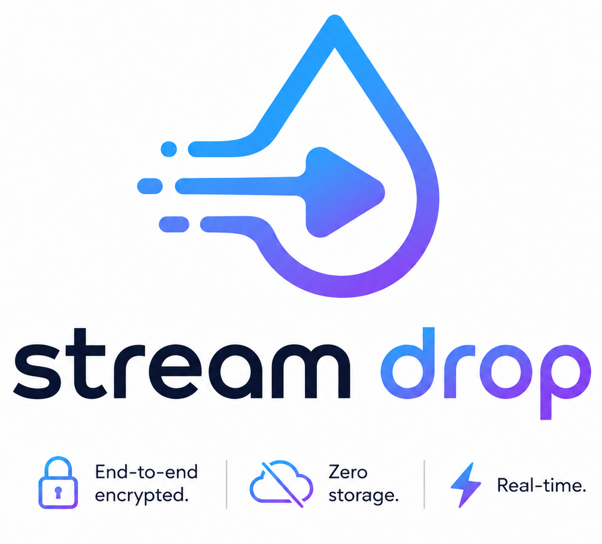

# StreamDrop

<p align="center">
  
</p>

StreamDrop is a zero-storage, end-to-end encrypted file transfer tool.
Files are encrypted in the sender's browser and streamed through the server in real time.

## How it works

- Sender opens the web app and selects files
- StreamDrop generates share links (the decryption key stays in the URL fragment after `#`)
- Receiver opens the link and downloads; decryption happens locally in the browser

## Quick start (local)

```bash
go run ./cmd/streamdrop/
```

Open http://localhost:3000.

## CLI

Build a portable CLI binary:

```bash
bun install
bun run cli:build
./dist/streamdrop --help
```

Send a file:

```bash
./dist/streamdrop send ./myfile.zip
```

Receive a file:

```bash
./dist/streamdrop receive "<share-url>"
```

Release binaries: GitHub Releases include prebuilt CLI binaries for macOS, Linux, and Windows, plus matching `.sha256` checksum files.

## Deploy

### Requirements

- Go 1.26+
- (Optional) Bun for CLI builds

### Run in production

```bash
go build -o streamdrop ./cmd/streamdrop/
PORT=3000 STREAMDROP_SERVER=https://streamdrop.app ./streamdrop
```

### Docker

```bash
docker build -t streamdrop .
docker run -p 3000:3000 streamdrop
```

### Environment variables

- `PORT` (default: `3000`)
- `STREAMDROP_SERVER` (default: `https://streamdrop.app`)
- `SESSION_TTL` (default: `12h`)
- `REAPER_INTERVAL` (default: `1m`)
- `WT_ADDR` (WebTransport listen address, default: `:3001`)
- `TLS_CERT` / `TLS_KEY` (TLS cert paths for WebTransport, default: `/tmp/wt-cert.pem` / `/tmp/wt-key.pem`)

### Reverse proxy notes

This app keeps some HTTP connections open (receiver wait / relay streaming). If you're deploying behind a reverse proxy or CDN, configure its read/idle timeouts accordingly.

## Docs (dev)

- [docs/implementation.md](./docs/implementation.md)

## iOS / Safari Compatibility

StreamDrop includes full fallback support for iOS and Safari. While Apple's WebKit engine does not currently support `ReadableStream` in `fetch()` bodies, StreamDrop automatically detects iOS and Safari and falls back to a highly optimized `XMLHttpRequest` chunking implementation. It is fully functional on all platforms!
